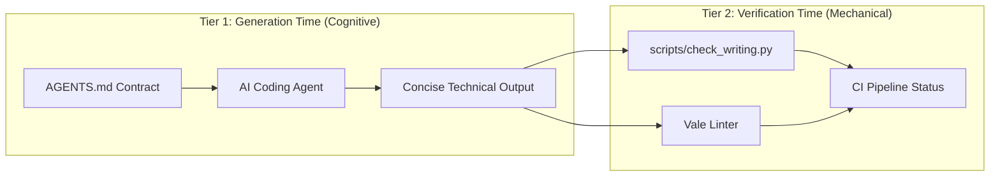

# AI Writing Systems & Cognitive Communication

[](https://github.com/chama-x/writing-systems/releases)
[](https://github.com/chama-x/writing-systems/actions)
[](https://github.com/marketplace/actions/ai-writing-systems-linter)
[](LICENSE)
[](https://agents.md)
[](https://agentskills.io)
[](#)
[](#)

Writing Systems eliminates conversational AI slop. It enforces Minto BLUF, Controlled Syntax, and anti-slop regularizers directly in Markdown documents.

---

## Quickstart: The One-Command Scaffolder

Scaffold the complete system with one terminal command:

```bash
npx writing-systems init
```

*Like `shadcn/ui`, you own the code. No permanent runtime dependencies added.*

### CLI Commands

- **Initialize project:** Run `npx writing-systems init` to scaffold `AGENTS.md`, Vale styles, and the Python linter.
- **Run prose audit:** Run `npx writing-systems check` to validate sentence length, slop words, and cadence variance.
- **Display system info:** Run `npx writing-systems info` to review the five universal operating invariants.

---

## Proof of Life: The Before & After Contrast

```text
┌── [BEFORE] DEFAULT CONVERSATIONAL AI SLOP (312 Tokens) ──────────────────────────┐
│ "Certainly! In today's cloud environment, it is important to examine our system  │
│ architecture. While microservices offer many modular components, they also       │
│ introduce complex operational dynamics. After carefully examining our           │
│ ingestion pipeline, we have come to the realization that migrating to a          │
│ monolithic binary could foster significant performance improvements..."          │
└──────────────────────────────────────────────────────────────────────────────────┘

┌── [AFTER] WRITING SYSTEMS MINTO BLUF (84 Tokens, -73% Waste) ────────────────────┐
│ Migrate event ingestion from microservices to a single Go daemon on bare metal.  │
│                                                                                  │
│ Microservices added 42ms of latency and introduced three network failure points. │
│ Consolidating to a monolithic daemon delivers three measurable results:          │
│ - Cost: Reduces AWS egress expenses by $18,000 each month.                       │
│ - Latency: Lowers 99th-percentile ingestion latency from 58ms to 6ms.            │
│ - Operations: Removes cross-service protobuf serialization and simplifies logs.  │
└──────────────────────────────────────────────────────────────────────────────────┘
```

---

## Two-Tier Enforcement Architecture

Cognitive invariants belong directly in model context. Mechanical checks run inside background linters to prevent prompt attention starvation.



- **Tier 1 (Cognitive Invariants):** `AGENTS.md` directs high-order model reasoning, active voice, bold anchors, and literal precision.
- **Tier 2 (Mechanical Checks):** `scripts/check_writing.py` and Vale enforce word ceilings, slop word blacklists, and monotone run detection in CI.

---

## The 5 Universal Operating Invariants

| Invariant | Target Standard | Operational Action | Prohibited Pattern |
| :--- | :--- | :--- | :--- |
| **1. Minto BLUF** | First 50 tokens | Apply Action, Conditional, or Diagnostic BLUFs | Greetings, conversational preambles |
| **2. Controlled Syntax** | Max 20w (proc) / 25w (desc) | Active voice; <= 3 consecutive nouns | Passive voice, run-on compound clauses |
| **3. Cadence Variance** | Alternate 5w and 25w | Alternate punchy assertions with compound mechanics | Monotone runs (>= 4 same length) |
| **4. Literal Precision** | Operational facts | State concrete system mechanics directly | Figurative metaphors, filler phrases |
| **5. Ubiquitous Language** | Canonical entity naming | Single canonical term per domain entity | Synonym drift within bounded context |

---

## AI Agent Integration (AIX)

Writing Systems adheres to the Linux Foundation AAIF standard and works across all major coding agents:

| Agent Platform | Integration Method | Configuration Path |
| :--- | :--- | :--- |
| **Claude Code** | Native reference | Symlinked in `CLAUDE.md` (`@AGENTS.md`) |
| **Cursor / Windsurf** | System rules | Included in workspace `.cursorrules` or root `AGENTS.md` |
| **Antigravity / Codex** | Portable skill | Loaded via `skills/writing-systems/SKILL.md` |
| **GitHub Copilot** | Workspace instructions | Placed in `.github/copilot-instructions.md` |

---

## The 4 Operational Surfaces

1. **[Human-Facing Prose](docs/human-prose.md):** Architecture decision records, RFCs, PR reviews, and technical specs. Covers Operational and Collaborative registers.
2. **[UI & Forms Design](docs/ui-microcopy.md):** Microcopy, action buttons, CLI flag help strings, Apple error triad, and accessibility.
3. **[Agent Directives](docs/prompt-engineering.md):** Production system prompts, polarity pairing, and behavioral guardrails.
4. **[Machine State Protocols](docs/inter-agent-protocols.md):** Typed JSON schemas, deterministic state diffs, and analytical subagent reporting envelopes.

---

## Automated CI/CD Integration

Add automated prose linting to your repository workflow with two lines:

```yaml
- name: Verify Writing Systems
  uses: chama-x/writing-systems@v1
  with:
    path: 'docs/**/*.md'
```

Or run the standalone Python validator locally:

```bash
python3 scripts/check_writing.py docs/*.md
```

---

## Repository Structure

```text
writing-systems/
├── AGENTS.md                    # Universal AI agent contract (AAIF / Linux Foundation)
├── CLAUDE.md                    # Claude Code pointer (@AGENTS.md)
├── action.yml                   # Composite GitHub Action for CI pipelines
├── bin/cli.js                   # Zero-dependency npx scaffolder
├── docs/                        # Authoritative topic guides
│   ├── core-principles.md       # Cognitive science, BLUF, and syntax bounds
│   ├── human-prose.md           # Technical documentation, RFCs, and PR reviews
│   ├── ui-microcopy.md          # UI text, CLI flags, and error recovery
│   ├── prompt-engineering.md    # System prompts and polarity pairing
│   ├── inter-agent-protocols.md # Machine state RPCs and analytical subagents
│   └── viral-case-studies.md    # 2026 distribution benchmarks and research
├── skills/                      # Portable agent skill (agentskills.io spec)
│   └── writing-systems/
│       └── SKILL.md             # On-demand tool skill for coding agents
├── scripts/                     # Standalone Python linter (zero dependencies)
│   └── check_writing.py         # Word count, slop word, and cadence auditor
├── .vale/                       # Vale prose linter configuration
└── LAUNCH_KIT.md                # Turnkey launch copy (HN, X, Reddit)
```

---

## License & Community

- **License:** Licensed under the [MIT License](LICENSE).
- **Contributing:** Read our [Contribution Guide](CONTRIBUTING.md) to propose invariant modifications.
- **Specification:** Adheres to Linux Foundation AAIF `AGENTS.md` and `agentskills.io`.
